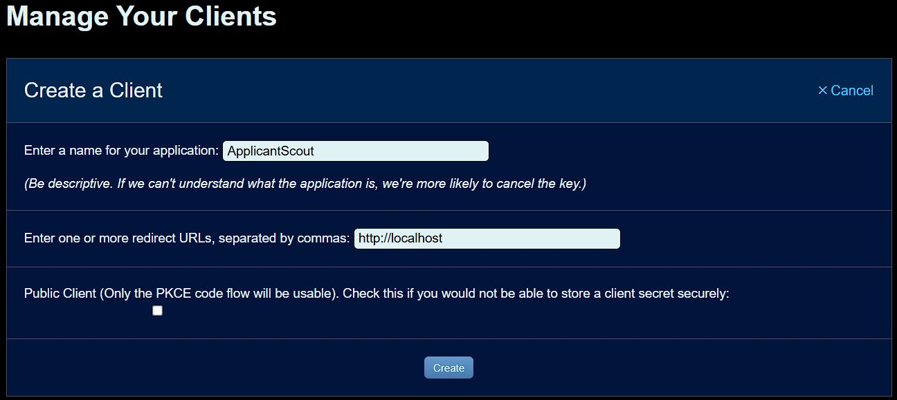

# Applicant Scout Companion

> [!IMPORTANT]
> Applicant Scout Companion is the **required second half** of ApplicantScout.
> The WoW addon captures applicant data; this companion decodes the screenshots
> and shows the Warcraft Logs / RaiderIO parse overlay. Install the
> [latest ApplicantScout addon release](https://github.com/Antrakt92/ApplicantScout-Addon/releases/latest)
> too.

Personal-tool overlay showing Warcraft Logs raid and Mythic+ percentiles for
players who apply to your WoW Mythic+ listing.

Pairs with the [ApplicantScout](https://github.com/Antrakt92/ApplicantScout-Addon)
WoW addon. The addon renders a QR code in-game and triggers screenshots while
you are hosting a listing. This companion watches the WoW `Screenshots` folder,
decodes ApplicantScout `APS1` QR payloads, queries Warcraft Logs, and renders
the overlay.

## Quick Start

1. Install the WoW addon side: download the packaged `ApplicantScout-*.zip`
   from [the latest addon release](https://github.com/Antrakt92/ApplicantScout-Addon/releases/latest),
   then extract it so the TOC is at
   `_retail_\Interface\AddOns\ApplicantScout\ApplicantScout.toc`. Do not use
   GitHub's automatic source-code ZIP for normal installs; it extracts to the
   wrong folder name for WoW. Reload WoW after installing or updating the addon.
2. Install ApplicantScout Companion from
   [this repository's releases page](https://github.com/Antrakt92/ApplicantScout-Companion/releases/latest).
3. Get Warcraft Logs API credentials:
   1. Open https://www.warcraftlogs.com/api/clients/.
   2. Click **Create Client**.
   3. Name: anything clear, for example `ApplicantScoutPersonal`.
   4. Redirect URL: exactly `http://localhost`.
   5. Public Client: leave unchecked.
   6. Create the client, then copy both the generated **Client ID** and
      **Client Secret**.

   Before you click **Create**, the form should look like this:

   
4. Launch ApplicantScout Companion from the Start Menu. First-run setup asks
   for your WCL Client ID/Secret and the active WoW `Screenshots` folder.
5. In WoW, enable ApplicantScout and host an M+ listing. The overlay updates
   when applicant snapshots arrive.

## Configuration

Use the Settings button in the companion title bar to edit WCL credentials,
region fallback, screenshots path, WCL data scope, WoW lifecycle sync, cache,
or logs. Settings save automatically as you change them. When the system tray is
available, closing the settings window hides it back to the tray; use the tray
menu's **Quit ApplicantScout** action to close the companion completely. If the
system tray is unavailable, closing Settings quits the companion so it cannot
keep running without a visible control surface. Settings are stored locally
under `%LOCALAPPDATA%\applicant-scout\config\config.env`.

Developer/source runs may still use a repo-local `.env` when the local config
file does not exist. Environment variables override both files.

Optional `.env` / `config.env` values:

```env
APSCOUT_SCREENSHOTS_PATH=C:\Games\World of Warcraft\_retail_\Screenshots
APSCOUT_REGION=EU
APSCOUT_CACHE_TTL_SECONDS=43200
APSCOUT_FETCH_MPLUS=1
APSCOUT_FETCH_RAID_NORMAL=0
APSCOUT_FETCH_RAID_HEROIC=0
APSCOUT_FETCH_RAID_MYTHIC=0
```

`APSCOUT_SCREENSHOTS_PATH` must point at the active WoW retail
`_retail_\Screenshots` folder; arbitrary folders are rejected because the addon
can only transport snapshots through WoW screenshots. `APSCOUT_REGION` is a
startup fallback; the addon sends the live region in its version snapshot when
available. `APSCOUT_CACHE_TTL_SECONDS` overrides the 12-hour WCL character cache
for debugging or support sessions; leave it unset for normal use. The
`APSCOUT_FETCH_*` flags are the same WCL data checkboxes from Settings. First
run defaults to M+ only; disabled metrics are not included in Warcraft Logs API
requests.

## In-Game Commands

```text
/apscout on | off       enable or disable capture
/apscout toggle         flip enabled state
/apscout config         open or close the settings panel
/apscout status         show current state and QR diagnostics
/apscout playstyle [off|learning|relaxed|competitive|carry] set M+ default playstyle
/apscout reset          clear dedup cache and force a fresh snapshot
/apscout shotnow        force a snapshot now
/apscout qrvisible      keep the QR frame visible for debugging
/apscout qrmove         toggle QR move mode; Alt+drag the QR frame
/apscout qrreset        reset QR frame position to top-left
/apscout taintcheck     inspect LFG field secret-tagging diagnostics
/apscout debug [on|off] toggle debug logging
/apscout competitive [on|off] legacy alias for Competitive / Off
```

## Overlay Data

The overlay shows context-aware fit labels for the hosted M+ key, package
ratings for grouped applicants who are accepted together, and raw WCL raid/M+
percentiles as supporting evidence. Healer M+ rows use HPS; tank and damage rows
use DPS.

The RIO column shows the applying character's current score. If the RaiderIO
addon is installed in WoW and exposes a higher current-season main score for an
alt, the overlay displays `current [main]` and uses the higher score for
sorting and fit support. With ApplicantScout addon wire v5, RaiderIO's
per-dungeon completed-key summary also helps the fit score avoid underrating
players who have near-target keys completed but no current Warcraft Logs data.
If RaiderIO is missing or has no profile for that character, the overlay falls
back to the applying character's score and available logs.

## Version Compatibility

ApplicantScout Companion supports the latest ApplicantScout WoW addon release
and ApplicantScout wire payloads through v5.

## Updates

ApplicantScout checks for updates hourly. When an installable stable GitHub
Release is available, Settings shows a blue download button. Clicking it
downloads the installer, verifies its `.sha256` checksum, and launches the
silent installer from inside the app. If the companion is running, the installer
closes it and relaunches it after the update. Portable ZIP artifacts are
published for manual/dev use but are not launched by the in-app updater.

Normal installs use the per-user directory
`%LOCALAPPDATA%\Programs\ApplicantScout Companion`, so routine installs and
updates should not require UAC elevation. Unsigned test builds can still trigger
Windows SmartScreen or antivirus warnings until a code-signing path is chosen.

## Support

Use GitHub Issues in `Antrakt92/ApplicantScout-Companion` for companion
setup, installer, WCL, or overlay issues and `Antrakt92/ApplicantScout-Addon` for
in-game addon issues. Keep support links out of the in-game addon UI.

## Local Data And Security

ApplicantScout does not read WoW memory, inject code, automate gameplay, or send
chat messages for transport. The addon renders QR snapshots and triggers normal
WoW screenshots; the companion reads only files in the configured Screenshots
folder.

Local files:

- Config and WCL Client ID/Secret:
  `%LOCALAPPDATA%\applicant-scout\config\config.env`
- OAuth token cache and WCL character cache:
  `%LOCALAPPDATA%\applicant-scout\cache\`
- Logs: `%LOCALAPPDATA%\applicant-scout\logs\`

Do not include `config.env`, `token.json`, or full logs in public bug reports
unless you have removed credentials, access tokens, character names, and realm
details you consider private.

## Troubleshooting

- Companion starts but overlay stays empty: open Settings -> Open logs and
  confirm the `Screenshots:` line points at the active `_retail_\Screenshots`
  folder.
- Want the companion to follow your game session: enable
  `Start and stop with WoW` in Settings. This starts a watcher for the current
  Windows session, applies immediately, and also adds a per-user Startup
  shortcut for future sign-ins.
- Companion reports a screenshot setup error: open Settings and set the active
  `_retail_\Screenshots` folder. If `APSCOUT_SCREENSHOTS_PATH` is set as a
  process environment variable, correct or remove that override first; saved
  Settings cannot override the process environment.
- WoW side looks idle: run `/apscout status` and check that ApplicantScout is
  enabled while you are hosting a listing.
- Need a manual sync: run `/apscout shotnow`; if applicant state looks stale,
  run `/apscout reset`.
- WCL cells stay empty: open Settings and use Test WCL.
- Screenshot cleanup is marker-safe: the watcher deletes only screenshots that
  decode to an ApplicantScout `APS1` payload. Manual screenshots and unrelated
  QR screenshots are left alone.
- QR transport uses hex encoding first and falls back to raw byte-mode QR when
  large snapshots would otherwise exceed QR capacity.

## Development

```powershell
.venv\Scripts\pip install -e .[dev] -c constraints-release.txt
.\scripts\check.ps1
```

Build Windows artifacts:

```powershell
.\scripts\build-windows.ps1
```

The installer path requires Inno Setup 6.x (`iscc.exe` on `PATH`). The full
build emits `dist\ApplicantScoutCompanionSetup-<version>.exe`, its matching
`dist\ApplicantScoutCompanionSetup-<version>.exe.sha256` checksum sidecar, and
the portable ZIP. Use `.\scripts\build-windows.ps1 -SkipInstaller` for a
portable ZIP-only smoke build.

The WoW addon is packaged from the `Antrakt92/ApplicantScout-Addon` repo with
`.\scripts\package-addon.ps1`; that artifact is named
`ApplicantScout-<version>.zip` and is separate from the companion portable ZIP.

Decode a saved screenshot manually:

```powershell
.venv\Scripts\python -m applicant_scout.screenshot C:\path\to\WoWScrnShot.jpg
```

## License

ApplicantScout Companion source code is MIT licensed; see `LICENSE`.

Windows builds also bundle third-party runtime components. See
`THIRD-PARTY-NOTICES.md` and the bundled `licenses/` directory in release
artifacts. PyQt is GPL v3 or commercial licensed, not LGPL; public binary
redistribution must be compatible with the PyQt license path used for the
build.
