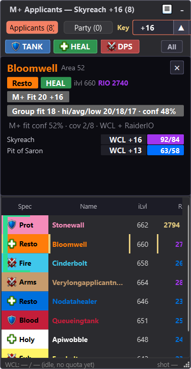
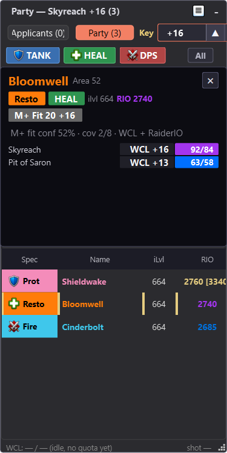

# ApplicantScout Companion

<p>
  <a href="https://github.com/Antrakt92/ApplicantScout-Companion/releases/latest"></a>
  <a href="https://github.com/Antrakt92/ApplicantScout-Addon/releases/latest"></a>
  
  
</p>

> The Windows overlay that turns ApplicantScout QR screenshots into Warcraft
> Logs, RaiderIO, raid-fit, Mythic+ fit, and current-roster context.

ApplicantScout Companion is the required second half of
[ApplicantScout](https://github.com/Antrakt92/ApplicantScout-Addon). The WoW
addon captures Group Finder applicants and current party/raid rosters through
normal screenshots; the companion decodes those screenshots, fetches Warcraft
Logs data, reads optional local RaiderIO context, and renders the overlay.

<p align="center">
  
  
</p>

> [!IMPORTANT]
> Install both pieces:
>
> 1. [ApplicantScout WoW addon](https://github.com/Antrakt92/ApplicantScout-Addon/releases/latest)
> 2. [ApplicantScout Companion for Windows](https://github.com/Antrakt92/ApplicantScout-Companion/releases/latest)

## What You Get

- **Applicant overlay:** WCL, RaiderIO, role, item level, raid/M+ context, and
  fit cells while your listing fills.
- **Party view:** current party/raid roster context a few moments after invites
  or after you join someone else's group.
- **Grouped-applicant handling:** package-level fit without hiding each
  character's own evidence.
- **Raid and M+ aware scoring:** raid listings keep raid evidence primary; M+
  listings focus on target-key fit and dungeon history.
- **Missing-evidence states:** no logs and single-run medians stay visible
  instead of pretending to be stable signal.
- **Local-first setup:** WCL credentials, cache, logs, and settings stay under
  your Windows user profile.

## Quick Start

1. Install the WoW addon through CurseForge, or download `ApplicantScout-*.zip`
   from [the latest addon release](https://github.com/Antrakt92/ApplicantScout-Addon/releases/latest).
   Do not use GitHub's automatic source-code ZIP for normal WoW installs; it
   extracts to the wrong folder name for WoW.
   The packaged addon ZIP should look like `ApplicantScout-<version>.zip`,
   separate from the companion portable ZIP, and extract so the TOC is at
   `_retail_\Interface\AddOns\ApplicantScout\ApplicantScout.toc`.
2. Install ApplicantScout Companion from
   [this repository's releases page](https://github.com/Antrakt92/ApplicantScout-Companion/releases/latest).
   Use `ApplicantScoutCompanionSetup-*.exe`; the portable ZIP is mainly for
   manual/dev use.
3. Create Warcraft Logs API credentials:
   1. Open https://www.warcraftlogs.com/api/clients/.
   2. Click **Create Client**.
   3. Name: anything clear, for example `ApplicantScoutPersonal`.
   4. Redirect URL: exactly `http://localhost`.
   5. Public Client: leave unchecked.
   6. Create the client, then copy both the generated **Client ID** and
      **Client Secret**.

   Before you click **Create**, the form should look like this:

   
4. Launch ApplicantScout Companion from the Start Menu. First-run setup asks for
   your WCL Client ID/Secret and the active WoW `_retail_\Screenshots` folder.
5. Reload WoW, enable ApplicantScout, then host a Mythic+ or raid listing or
   join a group. The overlay updates when applicant or roster snapshots arrive.

## How The Companion Fits

WoW addons cannot query Warcraft Logs directly from inside the game client, so
ApplicantScout is split intentionally:

- The addon watches Blizzard UI state and emits compact `APS1` QR snapshots.
- WoW writes normal screenshots.
- The companion watches only the configured Screenshots folder, decodes
  ApplicantScout QR payloads, fetches WCL data, reads optional local RaiderIO
  data, and updates the overlay.

The QR frame appears only during the screenshot capture window so it stays out
of the way between snapshots.

ApplicantScout temporarily raises screenshot quality and uses JPG format while
enabled, then restores your prior screenshot settings when you turn it off with
`/apscout off`.

## Overlay Data

The overlay shows a context-aware numeric fit score for the hosted key or raid,
coloured with the Warcraft Logs percentile palette, package ratings for grouped
applicants, and raw WCL raid/M+ percentiles as supporting evidence. Raid
listings place the fit signal in the matching Normal/Heroic/Mythic column,
while M+ listings focus on the target key and dungeon history.

The RIO column shows the applying character's current score. If the RaiderIO
addon is installed in WoW and exposes a higher current-season main score for an
alt, the overlay can display `current [main]` and use the stronger context for
sorting fallback support. RaiderIO dungeon summaries and highest timed keys
also feed the M+ scorecard and hover/detail context when local RaiderIO data is
available.

Party view can use the current group leader's keystone as the automatic Mythic+
target key. A manual Party key override still takes priority, raid contexts
ignore leader-key calibration, and manually clicking Party keeps the overlay
there while you review the group.

## Trust And Local Data

ApplicantScout Companion does not ask for Blizzard credentials or account
access. It does not read WoW memory, inject code, automate gameplay, or send
chat messages for transport.

Local files:

- Config and WCL Client ID/Secret:
  `%LOCALAPPDATA%\applicant-scout\config\config.env`
- OAuth token cache and WCL character cache:
  `%LOCALAPPDATA%\applicant-scout\cache\`
- Decoded local RaiderIO lookup payload cache:
  `%LOCALAPPDATA%\applicant-scout\cache\raiderio-local`
- Logs:
  `%LOCALAPPDATA%\applicant-scout\logs\`

If the RaiderIO addon is installed, the companion can read local RaiderIO addon
database files under `_retail_\Interface\AddOns\RaiderIO\db` to enrich
score/progress context.

Before sharing support material publicly, redact `/apscout status` output,
`/apscout taintcheck` output, companion logs, QR screenshots, manual decode
output, `config.env`, `token.json`, and `character-cache.json`. These can
include WCL Client ID/Secret, OAuth access token, character names, realm names,
listing titles/comments, screenshots folder paths, keystone/listing metadata,
and WCL/RaiderIO evidence.

QR screenshots may remain if the companion is absent, interrupted, pointed at
the wrong folder, or the Screenshots folder is synced/shared before cleanup.

ApplicantScout has a signing-ready release pipeline, but public Windows builds
remain unsigned until a code-signing certificate is configured with
`APSCOUT_SIGNING_CERT_SHA1`. SmartScreen can still warn on first install.
The `.sha256` sidecar verifies file integrity, not publisher identity.

## Settings

Use the Settings button in the companion title bar to edit WCL credentials,
region fallback, screenshots path, WCL data scope, WoW lifecycle sync, cache,
or logs. Settings save automatically as you change them.

When the system tray is available, closing the settings window hides it back to
the tray; use the tray menu's **Quit ApplicantScout** action to close the
companion completely. If the system tray is unavailable, closing Settings quits
the companion so it cannot keep running without a visible control surface.

Developer/source runs may still use a repo-local `.env` when the local config
file does not exist. Environment variables override both files.

Optional `.env` / `config.env` values:

```env
APSCOUT_SCREENSHOTS_PATH=C:\Games\World of Warcraft\_retail_\Screenshots
APSCOUT_REGION=EU
APSCOUT_CACHE_TTL_SECONDS=43200
APSCOUT_FETCH_MPLUS=1
APSCOUT_FETCH_RAID_NORMAL=0
APSCOUT_FETCH_RAID_HEROIC=0
APSCOUT_FETCH_RAID_MYTHIC=0
APSCOUT_SYNC_WITH_WOW=0
```

`APSCOUT_SCREENSHOTS_PATH` must point at the active WoW retail
`_retail_\Screenshots` folder. `APSCOUT_FETCH_*` flags match the WCL data
checkboxes from Settings. Disabled metrics are not included in Warcraft Logs
API requests.

## Updates

ApplicantScout Companion checks for updates hourly. When an installable stable
GitHub Release is available, Settings shows a blue download button. Clicking it
downloads the installer and verifies its `.sha256` checksum.

Current unsigned builds can still launch from the in-app updater after checksum
verification. The `.sha256` sidecar verifies file integrity; it does not prove
publisher identity. If the companion is running, the installer closes it and
relaunches it after the update. Portable ZIP artifacts are published for
manual/dev use but are not launched by the in-app updater.

Normal installs use the per-user directory
`%LOCALAPPDATA%\Programs\ApplicantScout Companion`, so routine installs and
updates should not require UAC elevation.

## In-Game Commands

```text
/apscout on | off       enable/disable capture
/apscout toggle         flip enabled state
/apscout config         open/close settings panel
/apscout status         show current state + QR diagnostics
/apscout playstyle [off|learning|relaxed|competitive|carry] set M+ default playstyle
/apscout reset          clear transport cache, queue fresh snapshot
/apscout shotnow        force snapshot now while enabled (debug / manual sync)
/apscout qrvisible      toggle QR frame always-visible (debug aid)
/apscout qrmove         toggle QR move mode (Alt+drag QR frame)
/apscout qrreset        reset QR frame position to top-left
/apscout taintcheck     probe C_LFGList field secret-tagging
/apscout debug [on|off] toggle debug logging
/apscout competitive [on|off] legacy alias for Competitive / Off
```

## Troubleshooting

- Companion starts but overlay stays empty: open Settings -> Open logs and
  confirm the `Screenshots:` line points at the active `_retail_\Screenshots`
  folder.
- Want the companion to follow your game session: enable
  `Start and stop with WoW` in Settings.
- Companion reports a screenshot setup error: open Settings and set the active
  `_retail_\Screenshots` folder. If `APSCOUT_SCREENSHOTS_PATH` is set as a
  process environment variable, correct or remove that override first.
- WoW side looks idle: run `/apscout status` and check that ApplicantScout is
  enabled while you are hosting a listing or reviewing Party view.
- Need a manual sync: keep ApplicantScout enabled and run `/apscout shotnow`;
  if applicant state looks stale, run `/apscout reset` while transport is active.
- WCL cells stay empty: open Settings and use Test WCL.
- Screenshot cleanup is marker-safe: the watcher deletes only screenshots that
  decode to an ApplicantScout `APS1` payload. Manual screenshots and unrelated
  QR screenshots are left alone. QR screenshots may remain if the companion is
  absent, interrupted, pointed at the wrong folder, or the Screenshots folder is
  synced/shared before cleanup.

## Version Compatibility

ApplicantScout Companion supports the latest published ApplicantScout WoW addon
release. This source tree also supports ApplicantScout wire payloads through v8.

## Development

```powershell
.venv\Scripts\pip install -e .[dev] -c constraints-release.txt
.\scripts\check.ps1
```

Build Windows artifacts:

```powershell
.\scripts\build-windows.ps1
```

The installer path requires Inno Setup 6.x (`iscc.exe` on `PATH`). The full
build emits `dist\ApplicantScoutCompanionSetup-<version>.exe`, its matching
`dist\ApplicantScoutCompanionSetup-<version>.exe.sha256` checksum sidecar, and
the portable ZIP. Use `.\scripts\build-windows.ps1 -SkipInstaller` for a
portable ZIP-only smoke build.

If a code-signing certificate is installed in the Windows certificate store,
set `APSCOUT_SIGNING_CERT_SHA1` to its certificate thumbprint before running the
build. The script signs the installer with `signtool` before `.sha256`
generation; without that variable the installer is intentionally left unsigned.

Decode a saved screenshot manually:

```powershell
.venv\Scripts\python -m applicant_scout.screenshot C:\path\to\WoWScrnShot.jpg
```

Check or remove saved ApplicantScout QR screenshots:

```powershell
applicant-scout cleanup-screenshots
applicant-scout cleanup-screenshots --delete
```

## Support

Use GitHub Issues in `Antrakt92/ApplicantScout-Companion` for companion setup,
installer, WCL, or overlay issues and `Antrakt92/ApplicantScout-Addon` for
in-game addon issues. Keep support links out of the in-game addon UI.

## License

ApplicantScout Companion source code is MIT licensed; see `LICENSE`.

Windows builds also bundle third-party runtime components. See
`THIRD-PARTY-NOTICES.md` and the bundled `licenses/` directory in release
artifacts. PyQt is GPL v3 or commercial licensed, not LGPL; public binary
redistribution must be compatible with the PyQt license path used for the
build.
