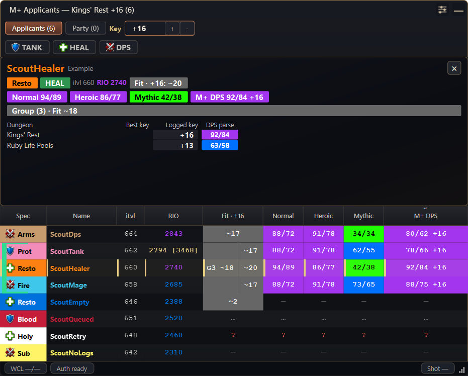
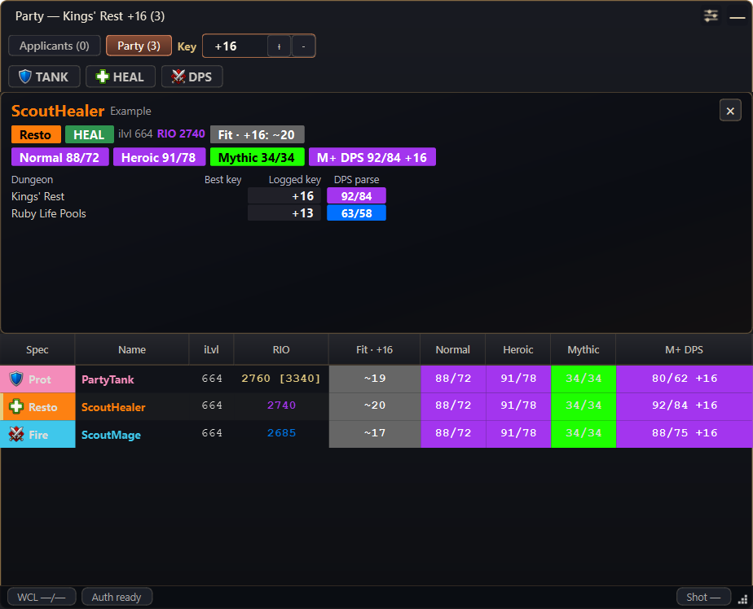
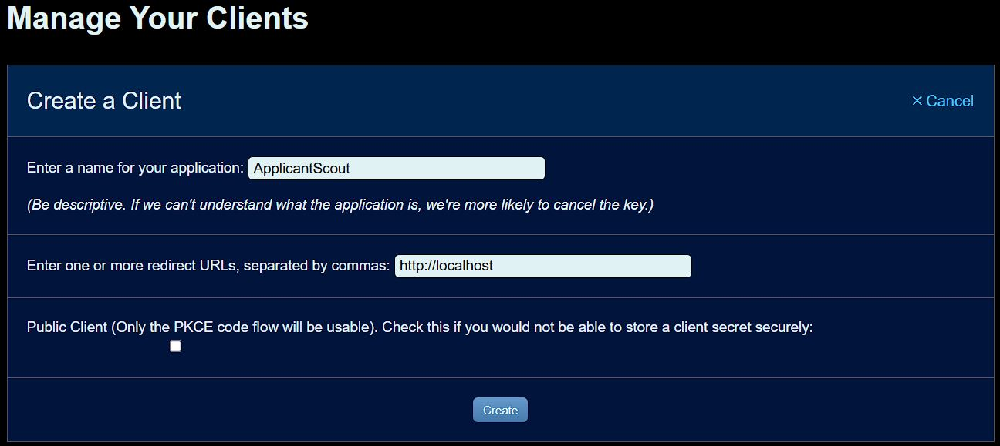

# ApplicantScout Companion

  
  
  
  

**Warcraft Logs and RaiderIO beside your WoW Group Finder.**

Compare Mythic+ and raid applicants, inspect players who applied together, and
review your current party or raid. ApplicantScout puts their logs, scores, and
experience in one table, with missing data clearly marked.

**This free Windows app works with the
[ApplicantScout WoW addon](https://www.curseforge.com/wow/addons/applicantscout-lfg-overlay).
You need both installed and running to receive group data.**

Supports current Retail Midnight and PTR builds — exact supported Interfaces
are listed on the
[addon page](https://www.curseforge.com/wow/addons/applicantscout-lfg-overlay).
For PTR, install the addon in that
client's AddOns folder and select its `Screenshots` folder in Companion Settings.
The companion watches one selected client at a time.

**[Download the Windows installer](https://github.com/Antrakt92/ApplicantScout-Companion/releases/latest)**
· **[Setup guide](docs/GETTING_STARTED.md)**

On the release page, use **Windows installer** near the top. The portable ZIP
is there too if you prefer to unpack and run the app yourself. Open its
`ApplicantScoutCompanion` folder and launch `ApplicantScoutCompanion.exe`;
checksums and other files remain under **Assets**. Current Windows builds are
unsigned, so SmartScreen may warn. See [Trust and local data](#trust-and-local-data).

Setup requires a free Warcraft Logs account and an API Client ID/Secret.
The guide shows how to create them. ApplicantScout does not ask for your
Blizzard password.

  
  

## What You Can Check

- Applicants' Warcraft Logs results, RaiderIO score, role and item level.
- Each member of a grouped application, with a combined Fit estimate.
- Your current party or raid after invites or after joining a group.
- Dungeon history, raid progress and results for the applying specialization.
- Available past-season RaiderIO ratings, with the highest shown below the
  current score when it is at least as high. Requires the local RaiderIO addon.

## Quick Start

1. Install the WoW addon through
   [CurseForge](https://www.curseforge.com/wow/addons/applicantscout-lfg-overlay)
   or [Wago](https://addons.wago.io/addons/ANzke264), or download `ApplicantScout-*.zip`
   from [the latest addon release](https://github.com/Antrakt92/ApplicantScout-Addon/releases/latest).
   Do not use GitHub's automatic source-code ZIP for normal WoW installs; it
   extracts to the wrong folder name for WoW.
   The packaged addon ZIP should look like `ApplicantScout-<version>.zip`,
   separate from the companion portable ZIP, and extract so the TOC is at
   `_retail_\Interface\AddOns\ApplicantScout\ApplicantScout.toc`.
2. Install ApplicantScout Companion from
   [this repository's releases page](https://github.com/Antrakt92/ApplicantScout-Companion/releases/latest).
   Use `ApplicantScoutCompanionSetup-*.exe`; the portable ZIP is mainly for
   manual/dev use.
3. Create Warcraft Logs API credentials:
   1. Sign in to [Warcraft Logs and open API Clients](https://www.warcraftlogs.com/api/clients/).
   2. Click **Create Client**.
   3. Name: anything clear, for example `ApplicantScoutPersonal`.
   4. Redirect URL: exactly `http://localhost`.
   5. Public Client: leave unchecked.
   6. Create the client, then copy both the generated **Client ID** and
      **Client Secret**.

   Before you click **Create**, the form should look like this:

   
4. Launch ApplicantScout Companion from the Start Menu. First-run setup asks for
   your WCL Client ID/Secret and the active WoW `_retail_\Screenshots` folder.
5. Reload WoW, enable ApplicantScout, then host a Mythic+ or raid listing or
   join a group. The overlay updates when applicant or roster snapshots arrive.

## Overlay Data

Fit estimates how the available evidence matches the target key or raid difficulty.
It is not a success probability or a Warcraft Logs percentile. Missing logs and
limited run history stay visible as missing or limited evidence.

M+ WCL values measure damage for every role, including healers and tanks. They do
not measure healing, survival, interrupts or utility. Raid healers use HPS; other
raid roles use DPS. Results belong to the applying specialization.

Applications sort by the listing's WCL percentile and grouped applicants stay
together. Fit is a separate estimate. Read [what each column and score means](docs/OVERLAY.md).

## How It Works

The addon sends group data through QR codes in ordinary WoW screenshots. The
companion reads the configured Screenshots folder locally and requests Warcraft
Logs results. Screenshots are not uploaded for those lookups. The optional
RaiderIO addon provides additional local dungeon, raid and past-season score
information. Missing historical data stays hidden; it does not affect Fit.

Updates pause in combat, throughout an active Mythic+ run and during raid boss
encounters. You can recruit between raid pulls. Screenshot settings are restored
after each capture; the companion cleans up screenshots it recognizes as
ApplicantScout data. See [transport and cleanup details](docs/REFERENCE.md).

## Trust And Local Data

**Optional usage statistics stay off until you opt in.**
Saved choices are preserved. Turn sharing on or off in Settings at any time. Reports
contain a random installation ID, version and daily setup/use milestones;
names, screenshots and credentials are excluded. Read [what is sent and retained](docs/PRIVACY.md).

Warcraft Logs requests include the character and realm needed for the lookup.
The app stores WCL credentials, caches and logs under your Windows user profile.
It does not ask for your Blizzard password, read WoW memory or automate gameplay.
Do not post credentials, caches or unredacted logs/screenshots in support issues.
See [local files and what to redact](docs/REFERENCE.md#trust-and-local-data).

Current Windows builds are unsigned. SmartScreen may warn or show an unknown
publisher. Download from the linked GitHub release and proceed only if you trust
the source. The `.sha256` sidecar verifies file integrity, not publisher identity.

## Code Signing Policy

Free code signing provided by SignPath.io, certificate by SignPath Foundation

This is a single-maintainer project: Author, Reviewer, and Approver are all
Antrakt ([github.com/Antrakt92](https://github.com/Antrakt92)). Windows release
binaries are built by CI from this repository. They are currently unsigned —
there is no publisher identity yet. If free signing through SignPath is
approved, future release builds will be signed through that pipeline.

Usage reporting is optional. The installer offers it defaulting to off and never
opts you in silently; see [what is sent and retained](docs/PRIVACY.md). You can
change the choice in Settings at any time.

## Settings And Updates

Settings lets you choose the Screenshots folder, WCL data types and usage sharing.
Mythic+, all raid difficulties and **Start and stop with WoW** start enabled when
no preference is saved. Your saved choices are preserved. A background helper
starts at Windows sign-in and waits for WoW. The companion opens when the game
starts and closes when it exits; turn sync off for manual launch and quit.
If Windows blocks the watcher, Settings shows a warning and an **Enable watcher**
button. A missing startup entry can be restored with **Repair watcher**.

The companion checks for updates hourly. Settings offers a download button for
stable releases and verifies the installer's checksum before starting the update.
Use **Quit ApplicantScout** in the tray menu to stop it completely.
Read [settings, keyboard controls and updates](docs/REFERENCE.md#settings).

## Support

Start with the [setup guide](docs/GETTING_STARTED.md) or
[troubleshooting](docs/REFERENCE.md#troubleshooting). For a manual sync, keep
ApplicantScout enabled and run `/apscout shotnow` out of combat; capture also
waits until an active Mythic+ run or boss encounter ends.

[Report a companion issue](https://github.com/Antrakt92/ApplicantScout-Companion/issues)
for setup, installation, WCL or overlay problems. Use
[addon issues](https://github.com/Antrakt92/ApplicantScout-Addon/issues) for in-game
problems. Report vulnerabilities through the private route in [SECURITY.md](SECURITY.md).

## Development

See [CONTRIBUTING.md](CONTRIBUTING.md) for a complete source setup, checks and
Windows build requirements. [Release history](RELEASE_NOTES.md) lists changes;
[the documentation index](docs/README.md) links the full reference.

## License

ApplicantScout Companion source is [MIT licensed](LICENSE). Windows builds also
include software under other licenses, including LGPL Qt and PySide6. See
[third-party notices and source access](THIRD-PARTY-NOTICES.md) and the bundled
`licenses/` directory for the applicable terms.
